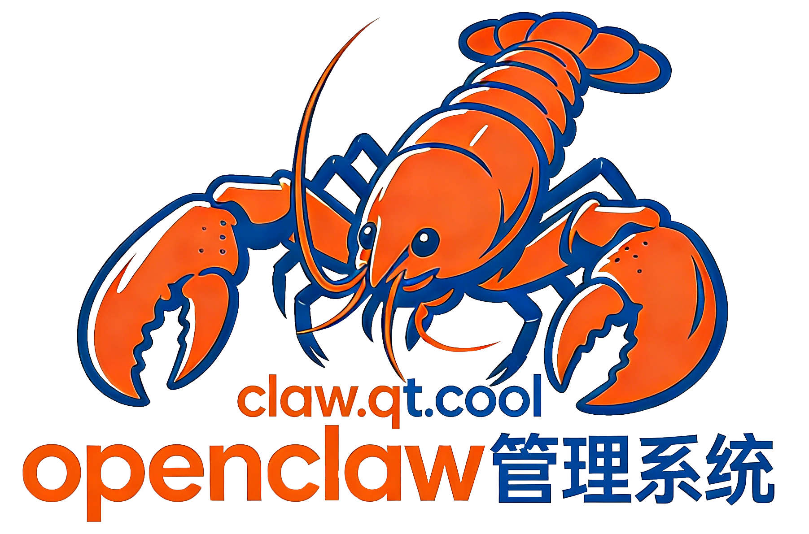

<p align="center">
  
</p>

<p align="center">
  ClawPanel Web — OpenClaw 可视化管理面板（纯 Web 版本）
</p>

<p align="center">
  <a href="https://github.com/Starktomy/clawecc/releases/latest">
    
  </a>
  <a href="https://github.com/Starktomy/clawecc/blob/main/LICENSE">
    
  </a>
</p>

---

ClawPanel 是 [OpenClaw](https://github.com/1186258278/OpenClawChineseTranslation) AI Agent 框架的可视化管理面板。**纯 Web 版本**，无需安装 Rust/Tauri，只要有 Node.js 18+ 即可运行。

## 快速开始

### 安装

```bash
git clone https://github.com/Starktomy/clawecc.git
cd clawecc/clawpanel
npm install
```

### 开发模式

```bash
npm run dev
# 浏览器打开 http://localhost:1420
```

### 生产构建

```bash
npm run build
# 产物在 dist/ 目录
```

### 启动 Web 服务器

```bash
npm run serve
# 默认监听 0.0.0.0:1420
```

## Docker 部署

```bash
docker run -d --name clawpanel -p 1420:1420 -v ~/.openclaw:/root/.openclaw nginx:alpine
# 将 dist/ 内容复制到 nginx html 目录
```

## 功能特性

- 🤖 AI 助手 — 内置智能 AI 助手，帮你安装配置 OpenClaw
- 📊 仪表盘 — 系统概览，服务状态实时监控
- ⚙️ 服务管理 — OpenClaw 启停控制、版本检测与升级
- 🔧 模型配置 — 多服务商管理、模型测试
- 📱 消息渠道 — Telegram、Discord、飞书、钉钉等
- 💬 聊天 — 流式响应、Markdown 渲染
- 📝 日志查看 — 多日志源实时查看
- 🧠 记忆管理 — 记忆文件查看/编辑

## 环境要求

- Node.js 18+
- OpenClaw (可选，Web 版会调用本机 OpenClaw CLI)

## License

MIT
